# Advanced Lane Finding

# Overview
In this project, I will write a software pipeline to identify the lane boundaries in a video from a front-facing camera on a car. The camera calibration images, test road images, and project videos are available in the project repository.

The steps of this project are listed below. You can have a look at [Advanced_Lane_Lines.ipynb](https://github.com/tinachientw/CarND-Advanced-Lane-Lines/blob/master/advanced_land_finding.ipynb) for the code.

# The Project

The goals / steps of this project are the following:

* Compute the camera calibration matrix and distortion coefficients given a set of chessboard images.
* Apply a distortion correction to raw images.
* Use color transforms, gradients, etc., to create a thresholded binary image.
* Apply a perspective transform to rectify binary image ("birds-eye view").
* Detect lane pixels and fit to find the lane boundary.
* Determine the curvature of the lane and vehicle position with respect to center.
* Warp the detected lane boundaries back onto the original image.
* Output visual display of the lane boundaries and numerical estimation of lane curvature and vehicle position.

## Initialization: Import and initialize the packages needed in the projects

* OpenCV - an open source computer vision library,
* Matplotbib - a python 2D plotting libray,
* Numpy - a package for scientific computing with Python,
* MoviePy - a Python module for video editing.

## Step 1: Compute the camera calibration using chessboard images
The next step is to perform a camera calibration. A set of chessboard images will be used for this purpose.

The camera_calibration() function takes as input parameters an array of paths to chessboards images, and the number of inside corners in the x and y axis.

For each image path, calibrate camera:
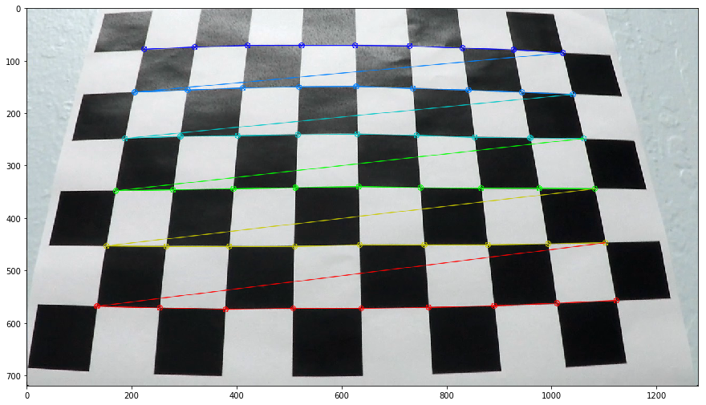
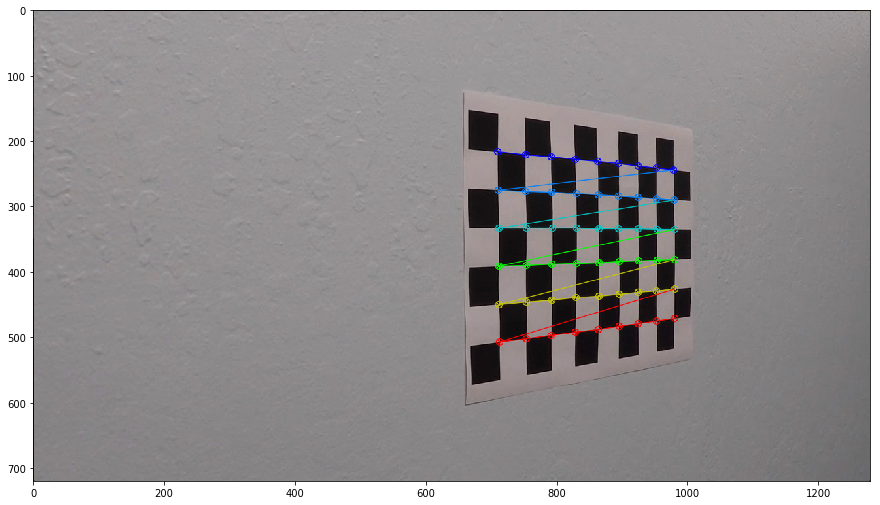
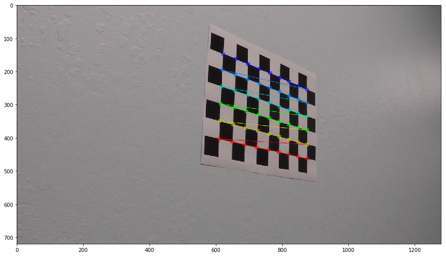
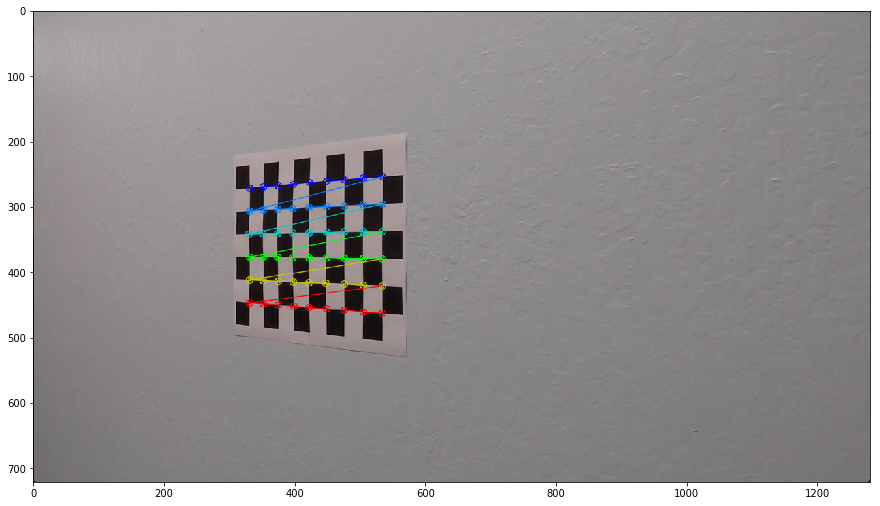

reads the image by using the OpenCV cv2.imread function,
converts it to grayscale usign cv2.cvtColor,
find the chessboard corners usign cv2.findChessboardCorners
Finally, the function uses all the chessboard corners to calibrate the camera by invoking cv2.calibrateCamera.

The values returned by cv2.calibrateCamera will be used later to undistort our video images.

## Step 2: Apply a distortion correction to raw images
Another OpenCv funtion, cv2.undistort, will be used to undistort images.

Below, it can be observed the result of undistorting one of the chessboard images:

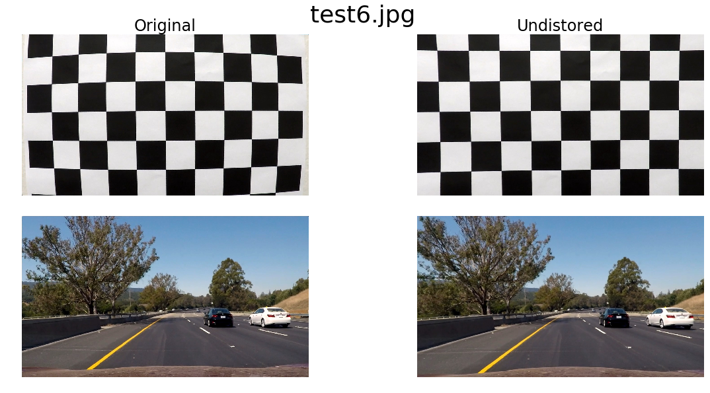

## Step 3: Use color transforms, gradients, etc., to create a thresholded binary image.
Different color space configurations of challenging frames
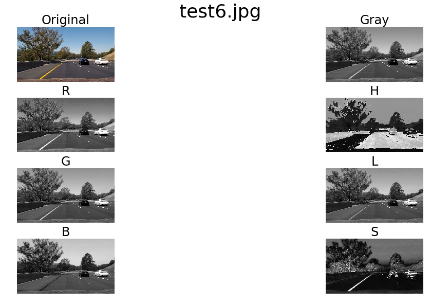
 
As we can see the lanes lines in the challenge and harder challenge videos were extremely difficult to detect. They were either too bright or too dull. So the get_thresholded_image() functionThis use R & G channel thresholding and L channel thresholding

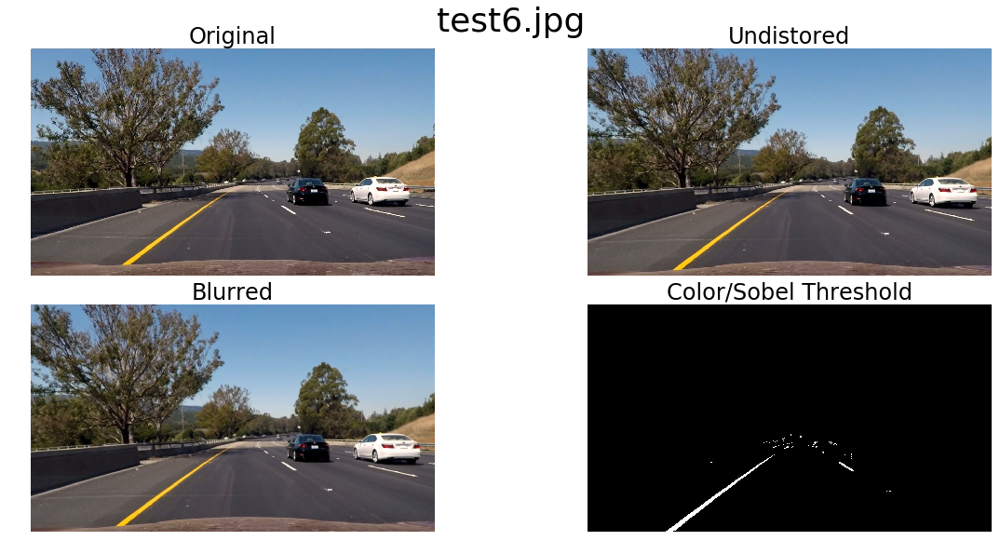

An in-depth explanation about how these functions work can be found at the [Lesson 15: Advanced Techniques for Lane Finding of Udacity's Self Driving Car Engineer Nanodegree](https://classroom.udacity.com/nanodegrees/nd013/parts/fbf77062-5703-404e-b60c-95b78b2f3f9e/modules/2b62a1c3-e151-4a0e-b6b6-e424fa46ceab/lessons/096009a1-3d76-4290-92f3-055961019d5e/concepts/016c6236-7f8c-4c07-8232-a3d099c5454a).

## Step 4: Apply a perspective transform to rectify binary image ("birds-eye view").

After manually examining a sample image, I extracted the vertices to perform a perspective transform. The polygon with these vertices is drawn on the image for visualization. Destination points are chosen such that straight lanes appear more or less parallel in the transformed image. Opencv function cv2.getPerspectiveTransform will be used to calculate both, the perpective transform M and the inverse perpective transform Minv. M and Minv will be used respectively to warp and unwarp the video images.

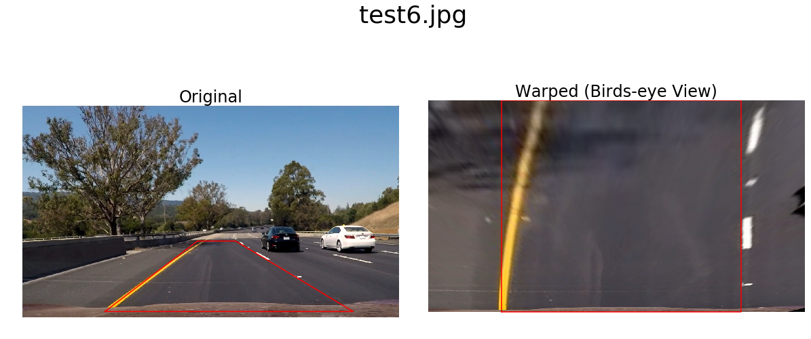

## Step 5: Detect lane pixels and fit to find the lane boundary.

* Use histogram of the lower half of the warped image. 

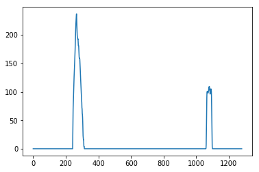

* Then, the starting left and right lanes positions are selected by looking to the max value of the histogram to the left and the right of the histogram's mid position.
* A technique known as Sliding Window is used to identify the most likely coordinates of the lane lines in a window, which slides vertically through the image for both the left and right line.
* Finally, usign the coordinates previously calculated, a second order polynomial is calculated for both the left and right lane line. Numpy's function np.polyfit will be used to calculate the polynomials.
Please find below the result of applying the detect_lines() function to the warped image: 

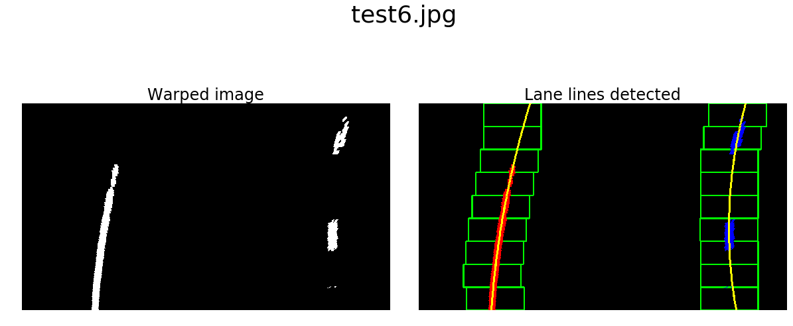

Once you have selected the lines, it is reasonable to assume that the lines will remain there in future video frames. detect_similar_lines() uses the previosly calculated line_fits to try to identify the lane lines in a consecutive image. If it fails to calculate it, it invokes detect_lines() function to perform a full search.

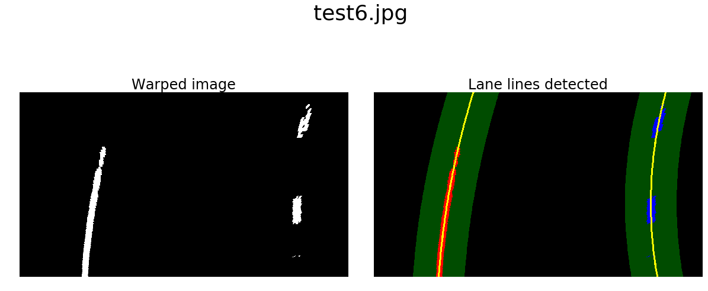

## Step 6: Determine the curvature of the lane and vehicle position with respect to center.

The radius of curvature is computed according to the formula and method described in the classroom material. Since we perform the polynomial fit in pixels and whereas the curvature has to be calculated in real world meters, we have to use a pixel to meter transformation and recompute the fit again.

The mean of the lane pixels closest to the car gives us the center of the lane. The center of the image gives us the position of the car. The difference between the 2 is the offset from the center.

For further information, please refer to [Lesson 15: Advanced Techniques for Lane Finding of Udacity's Self Driving Car Engineer Nanodegree](https://classroom.udacity.com/nanodegrees/nd013/parts/fbf77062-5703-404e-b60c-95b78b2f3f9e/modules/2b62a1c3-e151-4a0e-b6b6-e424fa46ceab/lessons/096009a1-3d76-4290-92f3-055961019d5e/concepts/016c6236-7f8c-4c07-8232-a3d099c5454a).

## Step 7. Warp the detected lane boundaries back onto the original image.
Inverse Transform : Paint the lane area Perform an inverse perspective transform Combine the precessed image with the original image.
nwarp.png

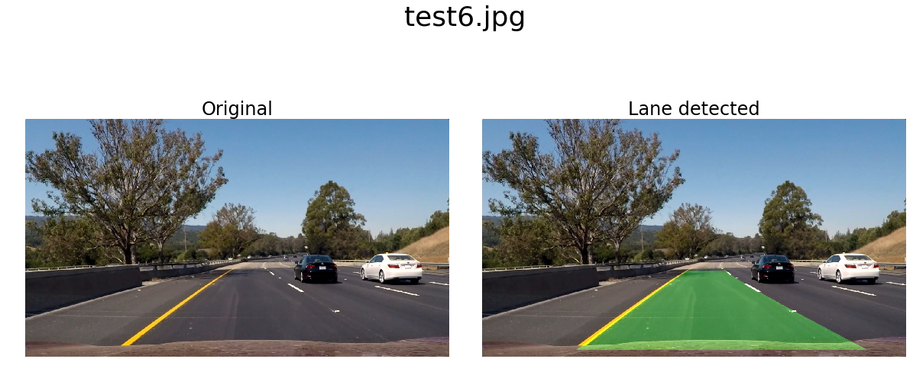

## Step 8. Output visual display of the lane boundaries and numerical estimation of lane curvature and vehicle position.
We apply the pipeline to a test image. This is the final result.

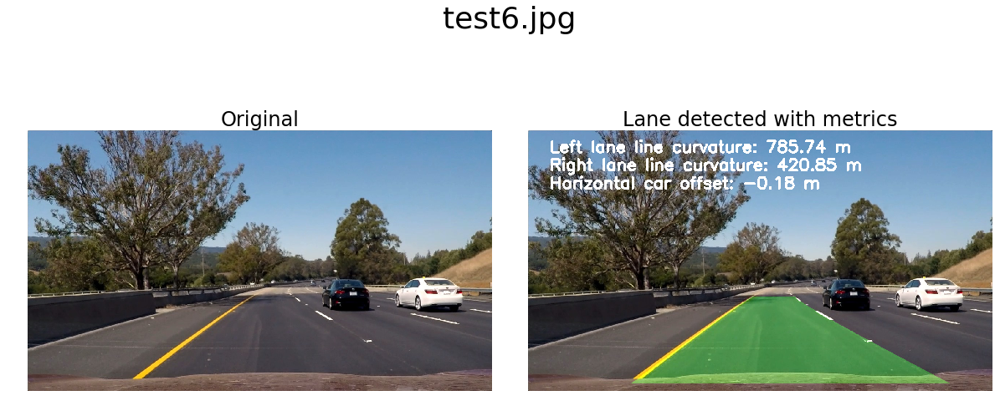

## The Video
The pipeline is applied to a video. Click on the image to watch the video or click [here](https://youtu.be/RIZyNokDw9o). You will be redirected to YouTube.

# Discussion
## Issues and Challenges
### Bad frames:
There will be some frames where no lanes will be detected or the lanes might not make sense. We determine the bad frames if any of the following conditions are met:

1. No pixels were detected using the sliding window search or search around the previously detected line.
2. The average gap between the lanes is less than 0.7 times pr greater than 1.3 times the globally maintained moving average of the lane gap.

Actions:

1. Perform a sliding window search again (this is done in the detect_lines function)
2. If this still results in a bad frame then we fall back to the previous well detected frame.

### Smoothing by Averaging lanes:
The lane for each frame is a simple average of 12 previously computed lanes. This is done in the get_averaged_line method in the code block below.

## Points of failure & Areas of Improvement
The pipeline seems to fail for the harder challenge video. This video has sharper turns and at very short intervals.
Future improvement:
1. Choose a smaller section to take the transform since this video has sharper turns and the lenght of a lane is shorter than the previous videos.
2. Make it more robust. Fist is a better binary mask calculation. Second, is a better mask calculation approach. But I do not think these manual crafting approaches are the best. I think that instead of trying to figure out the best set of hyperparameters by hand, it is better to let the computer figure it out automatically. 

